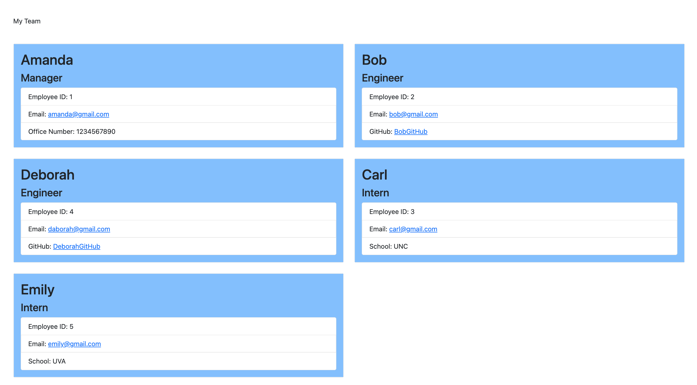
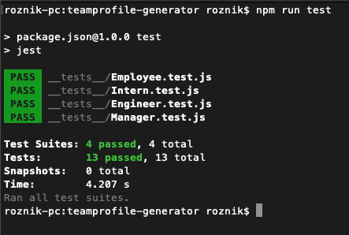

# Object-Oriented Programming: Team Profile Generator

## Description
From the assignment:
```
Your challenge is to build a Node.js command-line application that takes in information 
about employees on a software engineering team and generates an HTML webpage that 
displays summaries for each person.
```
This project has four classes: Employee, Manager, Engineer, and Intern. The tests for these classes are in ```_tests_```.

## User Story
```
AS A manager
I WANT to generate a webpage that displays my team's basic info
SO THAT I have quick access to their emails and GitHub profiles
```

## Acceptance Criteria
```
GIVEN a command-line application that accepts user input
WHEN I am prompted for my team members and their information
THEN an HTML file is generated that displays a nicely formatted team roster based on user input
WHEN I click on an email address in the HTML
THEN my default email program opens and populates the TO field of the email with the address
WHEN I click on the GitHub username
THEN that GitHub profile opens in a new tab
WHEN I start the application
THEN I am prompted to enter the team manager’s name, employee ID, email address, and office number
WHEN I enter the team manager’s name, employee ID, email address, and office number
THEN I am presented with a menu with the option to add an engineer or an intern or to finish building my team
WHEN I select the engineer option
THEN I am prompted to enter the engineer’s name, ID, email, and GitHub username, and I am taken back to the menu
WHEN I select the intern option
THEN I am prompted to enter the intern’s name, ID, email, and school, and I am taken back to the menu
WHEN I decide to finish building my team
THEN I exit the application, and the HTML is generated
```

The recommended starting directory structure is shown below.
```
.
├── __tests__/             //jest tests
│   ├── Employee.test.js
│   ├── Engineer.test.js
│   ├── Intern.test.js
│   └── Manager.test.js
├── dist/                  // rendered output (HTML) and CSS style sheet      
├── lib/                   // classes
├── src/                   // template helper code 
├── .gitignore             // indicates which folders and files Git should ignore
├── index.js               // runs the application
└── package.json     
```

## Mock Up


## Installation
In order to install ```inquirer```, please use ```npm i inquirer@8.2.4```
Next you will need ```npm install jest --save-dev``` which saves it to ```devDependencies```.

If you are cloning the project, use:
```
npm install
```
## Usage
The application is invoked in the command line with:
```
node index.js
```

## Tests
We use [Jest](https://jestjs.io/) to test. Enter:
```
npm run test
```
